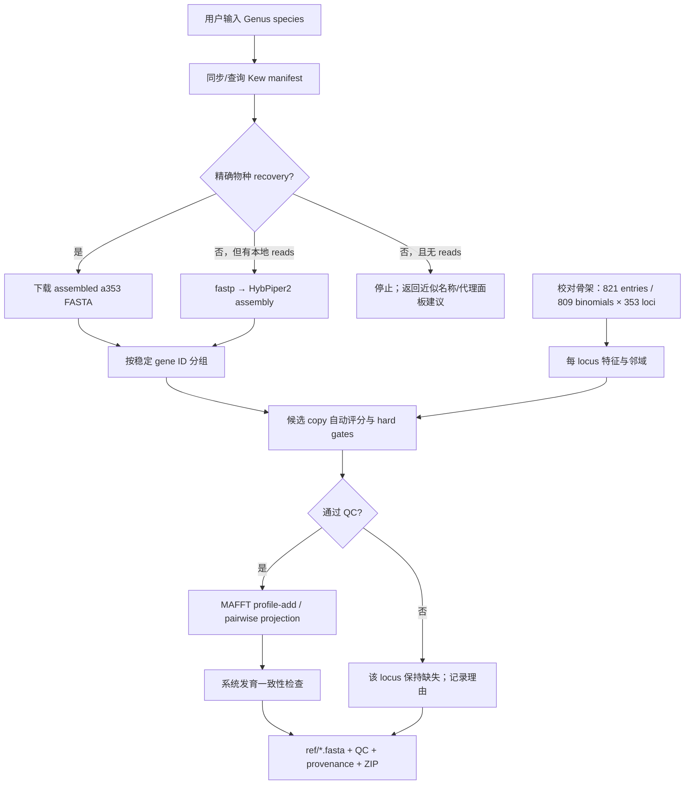

# SPrOUT Reference Builder 技术设计

## 1. 结论与可行性边界

这个设想可行，而且 Kew 已经提供了比“每次从 raw reads 重做 assembly”更合适的默认入口。
Tree of Life Release 4.0 包含 64 orders、417 families、12,239 genera、20,375 species 和
20,475 samples；公开目录同时提供 raw accession manifest、每个 recovery 的 Angiosperms353
assembled FASTA、每 gene FASTA/alignment、gene trees 和 species tree。程序应优先下载目标
specimen 的 `fasta/by_recovery/*.a353.fasta`，只在用户输入新的 FASTQ 时运行 HybPiper。

有一个必须诚实保留的生物学边界：如果目标物种没有自己的 reads、genome、transcriptome 或
Kew recovery，仅凭近缘物种不能生成真正的“该物种 reference”。近缘 consensus 可以提高 reads
捕获率，却不能承载物种特异变异；若仍标成目标物种，会制造过度自信的 species-level 鉴定。
因此本流程的策略是：

1. 精确物种存在 Kew recovery：生成 species-level 新 reference。
2. 用户提供该物种 reads：自动组装、QC 后生成 species-level 新 reference。
3. 只有同属/同科近缘序列：仅返回候选和“genus/family proxy panel”建议，不伪造物种序列。

## 2. SPrOUT 输入契约

SPrOUT 有两类容易混淆的数据：

| 数据 | SPrOUT 位置 | 形态 | 本项目是否生成 |
|---|---|---|---|
| HybPiper target/probe | `01_exons_assembly.py -m` | 多 target sequence 的未比对 FASTA | 否 |
| 系统发育 reference | `02_exon_trees.py -r` | 目录；每 gene 一个等宽多物种 alignment | 是 |

SPrOUT 第二步对每个 query exon 执行 `mafft --addfragments <query> <reference alignment>`，随后
trimAl 和 FastTree/IQ-TREE。因此最终交付不是一个 mega353 target file，而是 `ref/4691.fasta`、
`ref/5064.fasta`……这样的目录。另附的 `requested_species_sequences.fasta` 只是审计/交换文件，
不能替代 `ref/`。

## 3. 数据获取层

不依赖 Tree of Life 前端的未公开私有 API。使用 Kew 文档化、可版本化的 public release 接口：

- `current_release/sequence_manifest.txt`：repository、accession、数据类型、species、project。
- `current_release/fasta/by_recovery/`：每个 specimen 的 353 基因 assembled recovery。
- `current_release/tree/species/treeoflife.current.tree`：恢复 order/family 并约束系统发育位置。
- release notes：锁定 release 版本和方法。

第一次 `sync` 下载 manifest 和目录索引；后续 taxon 搜索完全本地完成。目标 recovery 和 species
tree 使用内容缓存。生产环境建议把 `current_release` 解析出的真实版本（例如 4.0）固化到项目
manifest，批量任务期间不要随 symlink 漂移。

Kew FASTA header 的首个字段是稳定 Angiosperms353 gene ID，因此无需通过相似性重新猜 gene。
`Order_Family_Genus_species` 从 Kew tree leaf label 恢复，再追加 accession 形成 SPrOUT header，
例如 `Malpighiales_Salicaceae_Abatia_rugosa_ERR7621122`。

## 4. 自动构建流程

### 4.1 候选 copy 仲裁

同一 specimen、同一 gene 可能因旁系同源、contig 分裂或多次 sequencing run 得到多个候选。
对每个候选计算：

- `length_ratio`：候选 ungapped 长度 / 校对骨架该 locus 中位数；
- `ambiguity_fraction`：非 A/C/G/T 比例；
- `nearest_kmer_similarity`：与骨架最近序列的 9-mer Jaccard；
- `stop_codon_fraction`：正反链六个 frame 中最低 stop 比例；
- `duplicate_count`：该 locus 的候选数，作为 copy 冲突惩罚；
- `order_support` / `family_support` / `genus_support`：top-25 骨架 k-mer 邻居对 Kew 预期
  clade 的相似度加权投票；同属高支持可覆盖旧骨架与当前 APG/Kew family 名称变化（例如旧
  Alliaceae 与当前 Asparagaceae），但不能覆盖 order 冲突；
- 生产增强项：mean depth、coverage uniformity、allele balance、HybPiper paralog warning、terminal
  branch z-score、与 species-tree placement 的 RF/quartet 冲突。

目前原型 hard gates 为：长度比 0.35–2.0、N/ambiguity ≤15%、9-mer similarity ≥0.015、最佳
frame stop ≤8%、top-neighbor order support ≥15%、family support ≥5%、综合分 ≥0.50。若该 locus
骨架中完全没有预期 order/family，则相应 gate 自动跳过。阈值是保守起点，不是普适真理；应用完整骨架做
leave-one-taxon-out calibration 后，应按 locus 或 clade 调整。

候选失败时不人工改碱基、不补 consensus，只把该 gene 的原骨架 alignment 原样复制，并在
`qc.json`/`report.json` 标记 rejected 或 missing。353 loci 本来允许不完全矩阵，这比伪序列安全。

### 4.2 加入 alignment

生产默认执行 MAFFT `--addfragments --keeplength`，将目标序列投影到已经人工校对的 alignment
坐标，不重新扰动校对骨架。这样避免全量 re-alignment 引起列漂移，也与 SPrOUT 随后的
`--addfragments` 逻辑一致。没有 MAFFT 时，纯 Python fallback：选择 k-mer 最近的骨架模板，做
global pairwise alignment，再把候选碱基投影到模板的已有 alignment 列；相对模板的 insertion
被丢弃。fallback 适合测试，正式 release 应使用 MAFFT 并记录版本。

### 4.3 第二阶段系统发育门控（生产建议）

当前原型实现序列级门控。进入生产前增加全自动 placement gate：

1. 对通过序列 QC 的 locus 用 EPA-ng/pplacer 放置到固定 gene tree，或用 IQ-TREE 约束建树。
2. 检查目标是否落入 Kew species tree 所指定 family；若同属样本 ≥2，再检查 genus crown。
3. 统计 353 genes 的 placement 投票。family 不一致或长枝异常的 locus 单独剔除。
4. specimen 级接受规则可设为：至少 30 loci，且 ≥80% informative loci 支持预期 family；
   species-level SPrOUT 输出建议至少 50–100 个高信息 loci，具体通过混合样本 benchmark 标定。

这一步能自动取代过去的“看树人工校对”，但必须输出不确定度，不能把统计阈值说成绝对正确。

### 4.4 从 SPrOUT 结果自动逐级细化

新增的 `build-kew-panel` 接受上一层的 `*_candidates.txt` 或 `*.predictions.csv`：family 层以
order 为父节点，genus 层以 family 为父节点，species 层以 genus 为父节点。程序用 Kew species
tree 将 manifest/recovery 映射到 taxonomy，再按目标类群做等量抽样：family 优先覆盖不同 genus，
genus 优先覆盖不同 species，species 每个物种默认只选一个 recovery。候选池先按 recovery 的
有效 Angiosperms353 locus 数排序；原始 recovery 或自动 QC 后低于 50 loci 的 specimen 默认
剔除。候选池大小默认是最终代表数的两倍，因此低质量 specimen 会由同组候选自动补位。

等量抽样是必要的：SPrOUT 当前 `04_prediction.py` 对同一 taxonomy 下所有 reference 的
`total_value` 求和。如果直接下载某个 order 下全部 Kew 样品，物种更多的 family 会获得结构性
优势。平衡 panel 降低这个偏差；后续仍建议在 SPrOUT 中加入按 reference/locus 数归一化的
top-k 或 trimmed-mean score，并用已知混合物标定阈值。

通过 QC 的 KEW sequences 以一次 MAFFT `--addfragments --keeplength`/locus 批量投影到完整骨架，
随后只输出本层选中的 KEW records。因此 100 个 specimens × 353 loci 不会启动 35,300 次 MAFFT。
若没有 MAFFT，Biopython fallback 会缓存骨架 k-mer 并逐条投影，主要用于测试而非大规模生产。

## 5. 机器学习如何使用

机器学习适合做异常检测和阈值校准，不适合生成 reference 碱基。

仓库的 `train-qc` 可在校对骨架及其模拟 0.4/0.6/0.8 长度合法片段上训练 Isolation
Forest（1% training contamination）。构建时默认只把 decision score `< -0.05` 的强异常作为
额外 reject；该值必须用完整骨架和独立样本校准。更成熟的模型应使用
leave-one-species/genus-out，避免同一 clade 泄漏到 train/test；输入包括上述序列特征，再加 reads
depth、mapping quality、copy number、gene-tree placement 和跨 gene 一致性。推荐两个层次：

1. **locus model**：判断 contig 是可信 ortholog、paralog、contaminant 或低质片段；若有人工历史
   标签，用 calibrated gradient boosting；无标签时用 Isolation Forest。
2. **specimen model**：汇总所有 loci，估计 family/genus/species reference 的可靠等级。

模型输出必须校准为 `pass / review-like-low-confidence / reject`，但这里的 “review-like” 仍由规则
自动处理（默认拒绝或降为 genus-level），不要求人工操作。评估指标应包括 false inclusion rate、
species/genus recall、expected calibration error，以及对 SPrOUT 混合样本最终 precision/recall 的影响。

## 6. 校对骨架的处理

已对用户提供的 interim ZIP 做可复现审计：353 loci、188,167 条 locus sequences、821 个
specimen/source entries、809 个唯一 binomials、61 orders、309 families。此前“871 × 353”是工作
描述，不是这个文件可复现出的唯一物种数。仓库提交 CSV 摘要和 checksum manifest，不把约
189 MB 解压 FASTA 混进普通 Git 历史；`install-backbone` 从原始 ZIP 安全重建：

- 每 gene 一个 `<gene_id>.fasta`；
- 文件内所有记录必须等宽；
- header 至少以 `Order_Family_Genus_species` 开头；
- gene ID 与 Kew/Angiosperms353 stable ID 一致；
- `inspect-backbone` 生成 locus/header 数和 gene list，可在 CI 中断言应为 353 loci。

若确认许可允许公开 FASTA，后续可将 ZIP 作为带版本号的 GitHub/Zenodo release asset 或 Git LFS
对象发布；无论采用哪种方式，都应保留 checksum、来源、许可、物种清单、alignment 软件版本和
校对版本。当前 `backbone_install.json` 已固定本次原始 ZIP 的 SHA-256。

### 6.1 Taxonomy corrections 与 mislabel blacklist

用户提供的 `corrections.xlsx` 已转换成版本化 TSV。`Corrections` 中 48 条记录作为精确 header
prefix replacement，在保留 accession/gene suffix 和原始序列的情况下更新 order、family、genus
或 species name。`Mislabled` 中 9 条记录的 suggested clade 表示序列在系统发育树上的异常落点，
并不能证明样品真实身份，因此默认从所有 locus 中删除，而不是改成 suggested taxonomy。

安装结束后重新生成 `gene_summary.csv` 与 `species_summary.csv`。manifest 记录 correction 文件
SHA-256、替换/排除的 locus-sequence 次数以及未命中规则；任何未命中项都需要审计原始 header
格式，但不会触发模糊匹配或静默修改。

## 7. 输出、可追溯性和失败语义

- `ref/*.fasta`：完整骨架；通过 QC 的 gene 多一条目标物种序列。
- `gene.list.txt`：与 reference 文件名一致，可直接传 SPrOUT。
- `requested_species_sequences.fasta`：仅包含目标物种通过 QC 的 ungapped sequences。
- `qc.json`：每个候选的原始特征、综合分、接受状态和拒绝原因。
- `report.json`：请求/解析 taxon、Kew release、accessions、accepted/rejected/missing loci、alignment
  方法和 SPrOUT `-r` 路径。
- `*_bundle.zip`：Web/CLI 可下载交付包。

错误不是静默 fallback：拼写不精确时返回 Kew 候选；没有 exact recovery 时停止；输出目录非空时
停止以避免覆盖；backbone 非等宽时停止；HybPiper/MAFFT 失败时保留日志并使任务失败。

## 8. 扩展到 20,000+ 物种

单物种按需构建无需建立 20,000 × 353 的重复文件。建议保存一个只读对象层：Kew recovery 按
accession 缓存，curated backbone 只存一次，build bundle 用 hardlink/content-addressed object 或按需
ZIP。批量预计算时以 `(Kew release, backbone version, accession, QC config hash)` 为 cache key。

服务层建议：FastAPI 只提交任务；Celery/RQ + Redis 排队；每个 job 写独立目录；对象存储保存
bundle；SQLite/PostgreSQL 保存 manifest/QC；限制并发下载并尊重 Kew 服务。对 20,000 species
建立 SQLite FTS taxon index，比每次读取 TSV 更快。所有外部命令记录 executable version、command
和 container digest。

## 9. 验证计划

1. **软件测试**：FASTA、manifest、tree label、候选仲裁、alignment 等宽、输出契约。
2. **leave-one-out**：从校对骨架移除一个物种，仅用其 Kew recovery 重建，比较 identity、gap
   pattern、tree placement；按 family 分层报告。
3. **扰动测试**：注入 truncation、N、chimera、reverse complement、paralog，测自动拒绝率。
4. **SPrOUT 端到端**：用原论文人工 mixture 和独立 mixture；比较旧 reference 与动态 reference 的
   order/family/genus/species precision、recall、false positive rate。
5. **盲测**：按 genus 阻断 train/test，确认 ML 没有靠近缘样本泄漏获得虚高结果。

### 9.1 mix7 实测

在 Kew Release 4.0 和本次 353-locus 骨架上，order、family、genus 三个 panel 均输出 353 个
等宽 FASTA。精确物种 recovery 的自动接受/拒绝/缺失 loci 分别为：Allium sativum
281/30/42、Asparagus officinalis 347/2/4、Brassica oleracea 350/0/3、Artocarpus
heterophyllus 349/2/2。Allium 的主要 rejection 原因是 recovered fragment 短于该 locus 骨架
中位长度的 35%。没有人工校对或自动改写碱基；失败 locus 保留原 skeleton 并记录理由。

需要严格限定这个结果的含义：用户给的是成分截图而不是 mix7 FASTQ，因此本 demo 模拟正确的
order/family 上游 calls，并只在 genus 阶段加入截图中的四个精确物种。它验证 reference construction
与 Kew integration，不验证从未知 reads 盲识别这四个物种。后者仍需原始 FASTQ 跑 SPrOUT
端到端 benchmark。

## 10. 主要来源

- [Kew Tree of Life Explorer](https://treeoflife.kew.org/)
- [Kew public release directory and format README](https://sftp.kew.org/pub/treeoflife/)
- [Baker et al. — A Comprehensive Phylogenomic Platform for Exploring the Angiosperm Tree of Life](https://doi.org/10.1093/sysbio/syab035)
- [Johnson et al. — A Universal Probe Set for Targeted Sequencing of 353 Nuclear Genes](https://doi.org/10.1093/sysbio/syy086)
- [McLay et al. — New targets acquired / mega353](https://doi.org/10.1002/aps3.11420)
- [Easy353](https://doi.org/10.1093/plphys/kiac495)
- [SPrOUT repository](https://github.com/nhu92/SPrOUT)
